# OpenStack

## 一.基础准备

两台虚拟机(controller和compute节点)

网卡配置(两张)

一张nat供堡垒机远程访问

一张仅主机供控制节点和计算节点访问(后面要用)

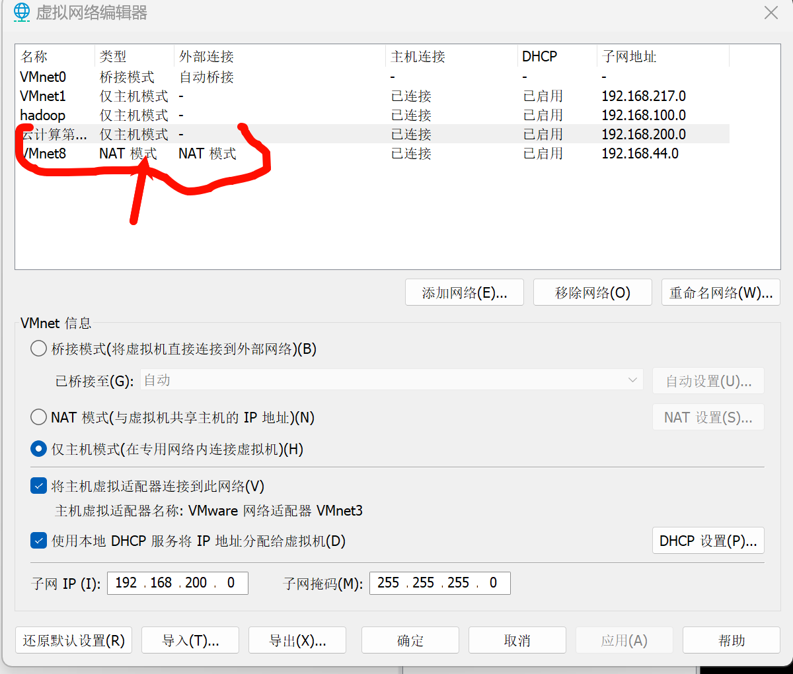

固定ip 两台节点固定nat网卡的ip

vi /etc/sysconfig/network-scripts/ifcfg-ens33

BOOTPROTO=static
IPADDR=192.168.44.201(202)
NETMASK=255.255.255.0
GATEWAY=192.168.44.1
ONBOOT=yes

磁盘配置

系统盘和外加的一块盘(第二块盘弄22gb,图片有误,后面要用)

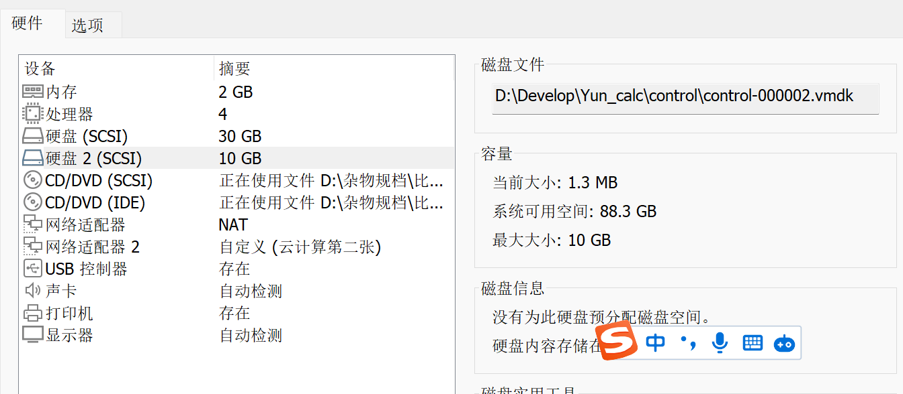

两块镜像(centos7和OpenStack)

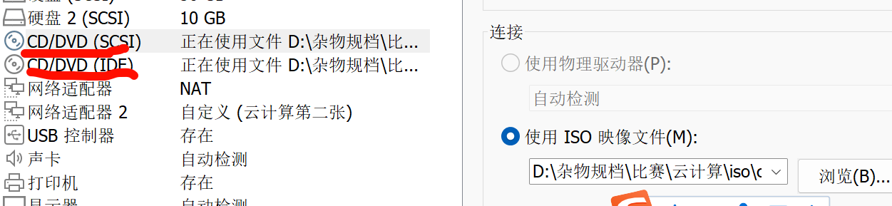

关闭防火墙和selinux

关闭防火墙:

```bash
systemctl stop firewalld
systemctl disable firewalld
```

selinux:

```bash
# vi /etc/selinux/config
修改 SELINUX=permissive
# setenforce 0 临时关闭Selinux
reboot
```

## 二.基础环境配置

### 1.主机名和hosts映射

（1）设置控制节点主机名为 controller，设置计算节点主机名为 compute； 

（2）修改 hosts 文件将 IP 地址映射为主机名； 完成后提交控制节点的用户名、密码和 IP 地址到答题框。 

1.第一个节点修改主机名：hostnamectl set-hostname controller 

2.第二个节点修改主机名：hostnamectl set-hostname compute 

bash可刷新查看

[root@controller ~]# bash

3.修改/etc/hosts 文件，添加两行如下： 

```
192.168.44.201 controller 
192.168.44.202 compute
```

### 2.Yum源配置(两个)

本地:

controller节点:

```shell
[root@controller ~]# mkdir /opt/{centos7-2009,iaas}
[root@controller ~]# mount /dev/sr0	/mnt/
[root@controller ~]# cp -r /mnt/* /opt/centos7-2009/
[root@controller ~]# umount /mnt/
[root@controller ~]# mount /dev/sr1	/mnt/
[root@controller ~]# cp -r /mnt/* /opt/iaas/
[root@controller ~]# umount /mnt/
[root@controller ~]# mv /etc/yum.repos.d/*  /media/
[root@controller ~]# vi /etc/yum.repos.d/yum.repo
```

```shell
[centos]
name=centos
baseurl=file:///opt/centos7-2009
gpgcheck=0
enabled=1
[iaas]
name=iaas
baseurl=file:///opt/iaas/iaas-repo/
gpgcheck=0
enabled=1
```

在线(比赛)

 [root@controller ~]# mv /etc/yum.repos.d/*  /media/

[root@controller ~]# vi /etc/yum.repos.d/yum.repo

```shell
[centos]
name=centos
baseurl=http://172.128.10.15/centos/
gpgcheck=0
enabled=1
[iaas]
name=iaas
baseurl=http://172.128.10.15/iaas/iaas-repo/
gpgcheck=0
enabled=1
```

清除并加载源

[root@controller ~]# yum clean all && yum repolist

compute节点在后续

### 3.配置免密SSH

controller和compute同时执行 ssh-keygen	一路回车

controller和compute同时执行ssh-copy-id controller	ssh-copy-id compute


补充:compute节点的yum源

首先在content安装ftp	并设置共享目录

```shell
[root@controller ~]# yum install -y vsftpd
[root@controller ~]# echo "anon_root=/opt" >> /etc/vsftpd/vsftpd.conf 
[root@controller ~]# systemctl start vsftpd
[root@controller ~]# systemctl enable vsftpd
```

配置compute节点yum安装源文件yum.repo，指向controller节点的共享文件目录路径。

[root@compute ~]# mv /etc/yum.repos.d/* /media/

[root@compute ~]# vi /etc/yum.repos.d/yum.repo

```shell
[centos] 
name=centos7-2009
baseurl=ftp://controller/centos7-2009
gpgcheck=0
enabled=1
[iaas]
name=iaas
baseurl=ftp://controller/iaas/iaas-repo
gpgcheck=0
enabled=1
```

清除并加载源

[root@compute ~]# yum clean all && yum repolist

在线和比赛的话和controller一样

## 三.OpenStack平台搭建

### 1.基础安装并配置

在控制节点和计算节点上分别安装 openstack-iaas 软件包

[root@controller ~]# yum -y install openstack-iaas

[root@compute ~]# yum -y install openstack-iaas

[root@controller ~]# vi /etc/openstack/openrc.sh

密码对应云主机的密码,其他密码均为000000(以实际数据为准)

```shell
HOST_IP=192.168.200.12
HOST_PASS=000000      #controller节点root用户密码
HOST_NAME=controller
HOST_IP_NODE=192.168.200.21
HOST_PASS_NODE=000000   #compute节点root用户密码
HOST_NAME_NODE=compute
network_segment_IP=192.168.200.0/24
DOMAIN_NAME=demo
INTERFACE_NAME=eth1   #云主机第二张网卡名称
minvlan=101
maxvlan=200
BLOCK_DISK=vdb1     #compute节点第一个分区名称
OBJECT_DISK=vdb2     #compute节点第二个分区名称
storage_local_net_io=计算节点ip
share_disk=vdb3  compute节点第三个分区名称
```


删掉每一行配置的#  :%s/^.\{1\}//		

1. （键盘）ctrl+ v 

2. （键盘）shift + g
3. （键盘） x

一键替换所有密码为000000	:%s/PASS=/PASS=000000/g

配置好了scp给compute节点

scp /etc/openstack/openrc.sh root@192.168.44.202:/etc/openstack/

BLOCK_DISK=vdb1     #compute节点第一个分区名称
OBJECT_DISK=vdb2     #compute节点第二个分区名称
SHARE_DISK=sdb3      #compute节点第三个分区名称


此处补充compute节点磁盘分区

tips:lsblk命令看到 sdb挂载到/mnt的话

1. 卸载/mnt的临时挂载	umount /mnt/
2. 删除/etc/fstab上的永久挂载配置   
3. fdisk /dev/vdb 对vdb进行分区

```shell
[root@compute ~]# lsblk
NAME            MAJ:MIN RM  SIZE RO TYPE MOUNTPOINT
sda               8:0    0   30G  0 disk 
├─sda1            8:1    0    1G  0 part /boot
└─sda2            8:2    0   29G  0 part 
  ├─centos-root 253:0    0   27G  0 lvm  /
  └─centos-swap 253:1    0    2G  0 lvm  [SWAP]
sdb               8:16   0   20G  0 disk 
sr0              11:0    1  973M  0 rom  
[root@compute ~]# fdisk /dev/sdb
欢迎使用 fdisk (util-linux 2.23.2)。
更改将停留在内存中，直到您决定将更改写入磁盘。
使用写入命令前请三思。
Device does not contain a recognized partition table
使用磁盘标识符 0xfc85e25d 创建新的 DOS 磁盘标签。
命令(输入 m 获取帮助)：n
Partition type:
   p   primary (0 primary, 0 extended, 4 free)
   e   extended
Select (default p):    
Using default response p
分区号 (1-4，默认 1)：
起始 扇区 (2048-41943039，默认为 2048)：
将使用默认值 2048
Last 扇区, +扇区 or +size{K,M,G} (2048-41943039，默认为 41943039)：+9G      
分区 1 已设置为 Linux 类型，大小设为 9 GiB
命令(输入 m 获取帮助)：wq    
The partition table has been altered!
Calling ioctl() to re-read partition table.
正在同步磁盘。


[root@compute ~]# fdisk /dev/sdb
欢迎使用 fdisk (util-linux 2.23.2)。
更改将停留在内存中，直到您决定将更改写入磁盘。
使用写入命令前请三思。
命令(输入 m 获取帮助)：n      
Partition type:
   p   primary (1 primary, 0 extended, 3 free)
   e   extended
Select (default p): 
Using default response p
分区号 (2-4，默认 2)：
起始 扇区 (18876416-41943039，默认为 18876416)：
将使用默认值 18876416
Last 扇区, +扇区 or +size{K,M,G} (18876416-41943039，默认为 41943039)：+9G
分区 2 已设置为 Linux 类型，大小设为 9 GiB
命令(输入 m 获取帮助)：wq
The partition table has been altered!
Calling ioctl() to re-read partition table.
正在同步磁盘。


[root@compute ~]# fdisk /dev/sdb
欢迎使用 fdisk (util-linux 2.23.2)。
更改将停留在内存中，直到您决定将更改写入磁盘。
使用写入命令前请三思。
命令(输入 m 获取帮助)：n
Partition type:
   p   primary (2 primary, 0 extended, 2 free)
   e   extended
Select (default p): 
Using default response p
分区号 (3,4，默认 3)：
起始 扇区 (20973568-41943039，默认为 20973568)：
将使用默认值 20973568
Last 扇区, +扇区 or +size{K,M,G} (20973568-41943039，默认为 41943039)：+5G
分区 3 已设置为 Linux 类型，大小设为 5 GiB
命令(输入 m 获取帮助)：WQ
The partition table has been altered!
Calling ioctl() to re-read partition table.
正在同步磁盘。

#刷新分区表
[root@compute ~]# partprobe	
[root@compute ~]# lsblk
NAME            MAJ:MIN RM  SIZE RO TYPE MOUNTPOINT
sda               8:0    0   30G  0 disk 
├─sda1            8:1    0    1G  0 part /boot
└─sda2            8:2    0   29G  0 part 
  ├─centos-root 253:0    0   27G  0 lvm  /
  └─centos-swap 253:1    0    2G  0 lvm  [SWAP]
sdb               8:16   0   20G  0 disk 
├─sdb1            8:17   0    5G  0 part 
├─sdb2            8:18   0    5G  0 part 
└─sdb3            8:19   0    5G  0 part 
sr0              11:0    1  973M  0 rom  
```


### 2.运行初始化脚本

运行iaas-pre-host.sh 注释uprade行,跑的更快

vi里:set nu显示行号

```shell
[root@controller ~]# vi /usr/local/bin/iaas-pre-host.sh  +41

[root@controller ~]# iaas-pre-host.sh

[root@compute ~]# iaas-pre-host.sh

重启reboot
```


### 3.搭建数据库服务

在 controller 节点上使用 iaas-install-mysql.sh 脚本安装 Mariadb、Memcached、RabbitMQ 等服务。安装服务完毕后，修改/etc/my.cnf 文件,优化

[root@controller ~]#  iaas-install-mysql.sh

[root@controller ~]#  vi /etc/my.cnf

```shell
lower_case_table_names = 1
innodb_buffer_pool_size = 4G
innodb_log_buffer_size = 64M
innodb_log_file_size = 256M
innodb_log_files_in_group = 2
```

[root@controller ~]# systemctl restart mariadb

一些ma,mq,memcached的操作命令

```shell
# mariadb

# 登陆数据库
mysql -uroot -p000000 
# 查询数据库中所有的库
show databases;
# 查询某个库中的所有表
use $databasename;
show tables;
# 查询某个表中的所有内容 （查）
select * from user;
# 创建一个数据库
create database abc123;
# 为数据库创建一个表
create table test123 (id int, name varchar(256));
# 插入数据到表中 （增）
insert into test123 values(1, 'cloud');
# 删除数据表中内容 （删）
delete from test123 where id=1 ;
# 修改数据表中内容 （改）
update  test123 set name='cloud2' where id=1 ;
# 查询指定字段
select id,name  from test123;

# 查询数据库的一些参数配置 （比赛时需要求改一些参数时可用）
mysql -uroot -p000000 -e " show variables;"


# rabbitmq
# 创建用户
rabbitmqctl add_user user1 000000

# 赋予权限
rabbitmqctl set_permissions user1  ".*" ".*" ".*"
# 标记tag
rabbitmqctl set_user_tags user1 administrator
# 查询用户
rabbitmqctl list_users

# memcached	
# 修改配置文件(缓存大小,最大连接数)
vim /etc/sysconfig/memcached
```


### 4.Keystone 服务安装与使用

在 controller 节点上使用 iaas-install-keystone.sh 脚本安装 Keystone 服务。安装完成后， 使用相关命令，创建用户 chinaskill，密码为 000000。完

依赖于httpd服务

```shell
# 控制节点使用脚本搭建
iaas-install-keystone.sh
# 基本使用
# 前提需要以登陆身份来执行命令
# 1.导入环境变量 以便于我们使用命令
source /etc/keystone/admin-openrc.sh
```

OpenStack --help | grep user	查看帮助命令
OpenStack user list 查看用户

创建用户

openstack user create --password 000000 chinaskill


#### 4.1命令补全

```shell
yum install -y bash*

# 退出终端

# 补全openstack命令
openstack complete >> .bashrc

# 重新source
source .bashrc
```

#### 4.2命令结构

```shell
# 1.结构
openstack <资源> <操作> [选项]

# 2.资源
# keustone
user (keystone) 用户
role (keystone) 角色
project (keystone) 项目
domain (keystone)  地域
# 不同域之间可以存在相同的项目 比如 华南域可以存在名为市场部的项目 华北域也可以存在名为市场部的项目
endpoint (keystone) 端点 # 记录一些服务的地址
# glance
image (glance) 镜像
# nova
server (nova) 实例 # 虚拟机
# neutron
network (neutron) 网络
subnet (neutron) 子网
port (neutron) 端口  # 网口 网线（另一头已经接在了我们集群中）
# cinder
volume (cinder) 卷 # 块设备 磁盘
# swift
container (swift) 容器 # 存放对象（文件） A文件放在A容器中


# 3.操作
create 创建
list   查询
set    设置
show   查询详细信息
delete 删除

# 4.选项 可选
# 一般是用于一些操作的具体限制
openstack user list --project admin # 限制查询admin项目中的用户
```

#### 4.3Keystone基本使用

首先 域在用户管理中是最大的概念

域下可以存在用户、项目

用户可以属于多个项目

比如test用户在A、B项目中都具备user角色

用户、项目一定要属于某个域

```shell
# 1.创建用户 (用户具备如下属性）
# 所属哪个域
openstack user create test
# 设置密码
openstack user set --password 000000 test 

# 2.设置权限
# 用户需要在项目中具备权限才可以正常使用
openstack role add --user test --project admin user

# 3.创建项目
openstack project create test --domain demo

# 4.创建域
openstack domain create test
```

#### 4.4使用(关于keystone的mysql操作)

```
#列出keystone所有的表
mysql -uroot -p000000
use keystone
show tables;
#导出表为keystone.sql
退出mysql终端
mysqldump -uroot -p000000 keystone >keystone.sql
ll
#使用sed命令显示文件keystone前20行
sed -n '1,20p' keystone.sql > keystone.txt
```


#### 4.5补充

一个project也可以存在多个用户，一个project下的多个用户资源都是互相可见的（自己创建的虚拟机同一项目都是可见）

如果需要隔离 则需要将两个用户分配到不同的project中

### 5.Glance安装与使用

在 controller 节点上使用 iaas-install-glance.sh 脚本安装 glance 服务,上传镜像并命名为 cirros，并设置最小启动需要的硬盘为 10G，最小启动需要的内存为 1G。

```shell
[root@controller ~]# iaas-install-glance.sh

#修改最大返回数
vi /etc/glance/glance-registry.conf
删掉注释,值改成1000

vi里面 /向下查找 ?向上查找
limit_param_default=1000
 systemctl restart  openstack-glance-*

镜像位置在前面配yum源

/opt/iaas/images/cirros-0.3.4-x86_64-disk.img,先复制到/root/下再上传

[root@controller ~]# cp /opt/iaas/images/cirros-0.3.4-x86_64-disk.img /root/

[root@controller ~]# source /etc/keystone/admin-openrc.sh

[root@controller ~]# glance image-create --name cirros --disk-format qcow2 --container bare --min-disk 10 --min-ram 1024 < cirros-0.3.4-x86_64-disk.img 
```

#### 5.1镜像注意事项

```shell
比赛的时候镜像文件在第三台云主机,网络源地址,先用curl命令下载下来,再进行上传操作

还有一种情况镜像保存在/var/lib/glance/images下
ls /var/lib/glance/images/aff14d68-c21e-443e-a79f-21d15dc0a45a
文件名称和镜像ID一致

其他服务也是类似 数据都是存放在/var/lib/<服务名称>

后续有创建cirros云主机其他操作

（1）上传镜像

 (2) 创建网络

 (3) 创建云主机(界面)
```


### 6.搭建Nova控制节点

搭建优化ler 节点和 compute 节点上分别使用 iaas-install-placement.sh 脚本、iaas-installnova -controller.sh 脚本、iaas-install-nova-compute.sh 脚本安装 Nova 服务。安装完成后， 修改 nova 相关配置文件

搭建只能先执行控制节点脚本再执行计算节点

placement (控制节点上负责收集计算节点资源状态的一个组件) -> conductor、schduler沟通的

placement是附属httpd上的服务

```shell
# 控制节点执行
[root@controller ~]# iaas-install-placement.sh (T版需要先执行这个)

# 控制节点执行
[root@controller ~]# iaas-install-nova-controller.sh （Q版的话直接执行这个）


# 状态检查
先引入环境变量
source /etc/keystone/admin-openrc.sh
openstack compute service list

# 修改配置文件
[root@controller ~]#  vi /etc/nova/nova.conf  vif_plugging_is_fatal=false
vif_plugging_timeout=1000

[root@controller ~]# systemctl restart openstack-nova*
```

### 7.搭建Nova计算节点

```
# 先在控制节点执行再到计算节点执行
[root@compute ~]# iaas-install-nova-compute.sh

# 状态检查
scp /etc/keystone/admin-openrc.sh compute
openstack compute service list
```


### 8.**搭建Neutron控制节点**

使用提供的脚本 iaas-install-neutron-controller.sh 和 iaas-install-neutron-compute.sh，在 controller 和 compute 节点上安装 neutron 服务

```shell
# 控制节点执行
iaas-install-neutron-controller.sh 


# 检查服务状态
source /etc/keystone/admin-openrc.sh
openstack network agent list(如果卡死,请重启)
正常输出:

+--------------------------------------+--------------------+------------+-------------------+-------+-------+---------------------------+
| ID                                   | Agent Type         | Host       | Availability Zone | Alive | State | Binary                    |
+--------------------------------------+--------------------+------------+-------------------+-------+-------+---------------------------+
| 1dc5a1b5-1e56-4725-98c4-d1f089891297 | Linux bridge agent | compute    | None              | :-)   | UP    | neutron-linuxbridge-agent |
| 79950978-04f5-45a6-a393-591f65a7762b | DHCP agent         | controller | nova              | :-)   | UP    | neutron-dhcp-agent        |
| 992c6267-f30b-4db5-8487-4582e675c436 | Linux bridge agent | controller | None              | :-)   | UP    | neutron-linuxbridge-agent |
| 9d3cf056-a803-47e7-bc66-a1ea2dbee54b | L3 agent           | controller | nova              | :-)   | UP    | neutron-l3-agent          |
| af17844e-c634-403c-af5a-171554c1d4c1 | Metadata agent     | controller | None              | :-)   | UP    | neutron-metadata-agent    |
+--------------------------------------+--------------------+------------+-------------------+-------+-------+---------------------------+


# network创建
openstack network create int-net

# subnet创建
openstack subnet create --network int-net  --subnet-range 192.168.0.0/16 int-sub

# 安全组（防火墙） 
# 规定了什么样的流量可以进可以出
# 放通0.0.0.0/0地址的ipv4的TCP协议进入到任何端口
openstack security group rule create --ingress --protocol TCP --ethertype ipv4 --remote-ip 0.0.0.0/0 <安全组ID>
```

### 9.搭建Neutron计算节点

```shell
# 计算节点执行
iaas-install-neutron-compute.sh
```

### 10.搭建验证

**image** 虚拟机模版 你可以通过image来启动不同的虚拟机

比如Centos7.9的模版

**flavor** 实例类型 （配置、规格） 几个CPU多少内存、硬盘大小

**network** 虚拟机的网络 用于虚拟机通信 虚拟机和外部网络的通信

```shell
# 创建一个实例
openstack server create --flavor  m1.tiny --network int-net --image cirrors verify-server

# 查询实例
openstack server list
```

### 11.补充

```shel
# 多使用--help来查看帮助文档
# 创建一个要求最小硬盘大小为10G 最小内存要求为2G的镜像
openstack image create --help  
# 查询所有参数以及介绍
```

### 12.Doshboard 安装(界面)

在 controller 节点上使用 iaas-install-dashboard.sh 脚本安装 dashboard 服务。安装完成 后，将 Dashboard 中的 Djingo 数据修改为存储在文件

Django项目基于httpd

```shell
**[root@controller ~]**# iaas-install-dashboard.sh

安装好后就会输出登录信息就可以进界面了

[root@controller ~]# cat logininfo.txt 
浏览器访问：http://192.168.44.201/dashboard
域：demo  
用户名：admin  
密码："000000" 

[root@controller ~]# vi /etc/openstack-dashboard/local_settings

将cache 改成file

SESSION_ENGINE = 'django.contrib.sessions.backends.file' 

[root@controller ~]# systemctl restart httpd  memcached
```

### 13.搭建Cinder块存储

搭建硬盘分别使用 iaas-install-cinder-controller.sh、iaas-install-cindercompute.sh 脚本安装 Cinder 服务，请在计算节点，对块存储进行扩容操作，即在计算节点再 分出一个 5G 的分区，加入到 cinder 块存储的后端存储中去

```shell
[root@controller ~]# iaas-install-cinder-controller.sh

[root@compute ~]#  iaas-install-cinder-compute.sh

先去计算节点再分一块盘
[root@compute ~]# vgextend cinder-volumes /dev/vdb4

Physical volume "/dev/vdb4" successfully created. Volume group "cinder-volumes" successfully extended
```

#### 13.1 cinder的使用

```
# 创建一个卷 （块设备）
openstack volume create --size 20 volume1

# 挂载到虚拟机上
openstack server add volume verify-server volume1查看服务
openstack volume list
vgs
```

### 14.搭建Swift 对象存储

在控制节点和计算节点上分别使用 iaas-install-swift-controller.sh 和 iaas-install-swiftcompute.sh 脚本安装 Swift 服务。安装完成后，使用命令创建一个名叫 examcontainer 的容 器，将 cirros-0.3.4-x86_64-disk.img 镜像上传到 examcontainer 容器中，并设置分段存放，每 一段大小为 10M。

```shell
[root@controller ~]# iaas-install-swift-controller.sh

[root@compute ~]# iaas-install-swift-compute.sh

[root@controller ~]# source /etc/keystone/admin-openrc.sh

[root@controller ~]# swift post examcontainer
(老命令)
openstack container create examcontainer(新命令)
如果老命令报认证错误可以试试新命令
#查看容器
openstack container list
[root@compute ~]# swift upload examcontainer -S 10000000 cirros-0.3.4-x86_64-disk.img
```


#### 14.1 swift的基本使用

```shell
# Swift存储 是基于容器的概念
# <容器>
# <对象>
# <文件>
# 容器相当于一个盒子 里面存放着我们上传的一些内容


# 创建容器
openstack container create waste

# 创建容器中的对象 (桶)
openstack object create waste cirros-0.3.4-x86_64-disk.img

# 保存文件到桶中
openstack object save waste --file cirros-0.3.4-x86_64-disk.img cirros-0.3.4-x86_64-disk.img
```


### 15.Keystone报错、或者Dashboard报错该怎么解决

```shell
# keystone dashboard 都是依赖于httpd服务运行的
# 1.先检查httpd服务状态	重启httpd和memcached
# 2.再检查数据库
# 3.memcached是否正常
```

16.其他组件错误

```shell
# 定位是什么类型的错误
# 如果是命令查询或者等操作无法正常使用
# 1.API服务出问题（检查服务状态、检查数据库状态、keystone）	还有最开始的openrc.sh配置和磁盘分区
# 2.查日志
# 3.根据日志再进行排查
```

### 15.共享文件存储Manila 的搭建

在控制和计算节点上分别使用 iaas-install-manila-controller.sh 和 iaas-install-manila-compute.sh 脚本安装 manila 服务。安装服务后创建 default_share_type 共享类型（不使用驱 动程序支持），接着创建一个大小为 2G 的共享存储名为 share01 并开放 share01 目录对 OpenStack 管理网段使用权限。

```shell
[root@controller ~]# iaas-install-manila-controller.sh

[root@compute ~]# iaas-install-manila-compute.sh

[root@controller ~]# source /etc/keystone/admin-openrc.sh

[root@controller ~]# manila type-create default_share_type False

 #创建共享文件目录 

[root@controller ~]# manila create NFS 2 --name share01 

#挂载共享目录

 [root@controller ~]# manila access-allow share01 ip 172.128.10.0/24 --access-level rw
```

#### 15.1 Manila的使用

```shell
# manila是一个提供共享文件存储(NFS)的服务
# manila的共享分类型（类型指的是具体后端的实现）
# 他是以NFS或者其他协议来将你这个文件存储给共享出去的
# 一般分为以下类型：
# 1.LVM
# 2.NAS
# 3.glusterfs (分布式存储)
# 4.Cephfs (分布式存储)

# 创建一个type
manila type-create LVM 0

# 创建一个共享(基于虚拟机之间 或者能够和计算节点存储网络通信的共享)
manila create NFS 10 --name share01 --share-type LVM

# 检查共享类型
manila list 

# 创建一个共享网络（在这个网络中的客户端都可以使用这个共享） # （可选）
manila share-network-create --name share01   --neutron-net-id  39a8d62a-2aaf-4da3-875e-d242c168c771 --neutron-subnet-id ff85e8ba-a8ba-4e1c-b68f-56a66a66b53e

# 创建一个访问权限 (设置那些网段具备什么样的访问权限)
manila access-allow --access-level rw aab205d2-d9e5-4282-8380-a17525f7d2c9  ip 10.24.20.0/24
```

### 16.栈堆Heat搭建与使用（编排）
heat是可以将一些列复杂的操作以yaml文件定义后创建

比如我们要创建一个镜像 一个实例类型 一个网络 一个实例是需要一步步执行的

可以把这些重复的步骤编写成一个yaml文件的形式 每次需要这一系列内容创建出来的时候 就修改相应参数来实现一次性完成 （只需要将重复复杂的事情做一遍） 后面就可以让heat来做重复步骤

```shell
# 控制节点执行
iaas-install-heat.sh
```


### 17Barbican 服务安装与使用

使用 iaas-install-barbican.sh 脚本安装 barbican 服务，安装服务完毕后，使用 openstack 命 令创建一个名为 secret01 的密钥

```shell
[root@controller ~]# iaas-install-barbican.sh
[root@controller ~]# source /etc/keystone/admin-openrc.sh

 [root@controller ~]# openstack secret store --name secret01 --payload secretkey
```


### 18.Cloudkitty 服务安装与使用

使用 iaas-install-cloudkitty.sh 脚本安装 cloudkitty 服务，安装完毕后，启用 hashmap 评级 模块，接着创建 volume_thresholds 组，创建服务匹配规则 volume.size，并设置每 GB 的价格 为 0.01。接下来对应大量数据设置应用折扣，在组 volume_thresholds 中创建阈值，设置若超 过 50GB 的阈值，应用 2%的折扣（0.98）。

[root@controller ~]# iaas-install-cloudkitty.sh

图形化创建

启用 hashmap 评级 模块

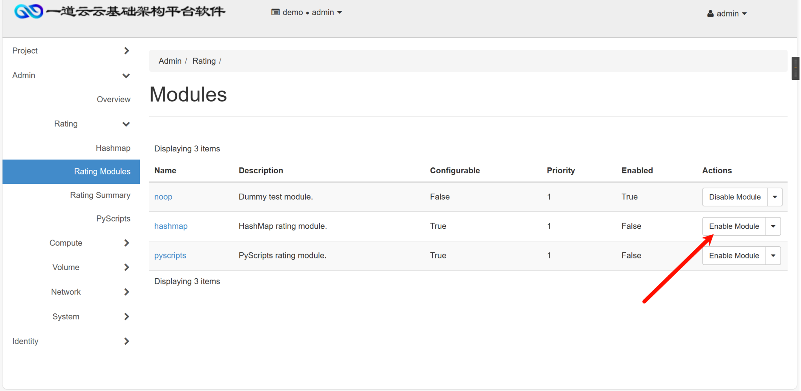

创建服务匹配规则 volume.size

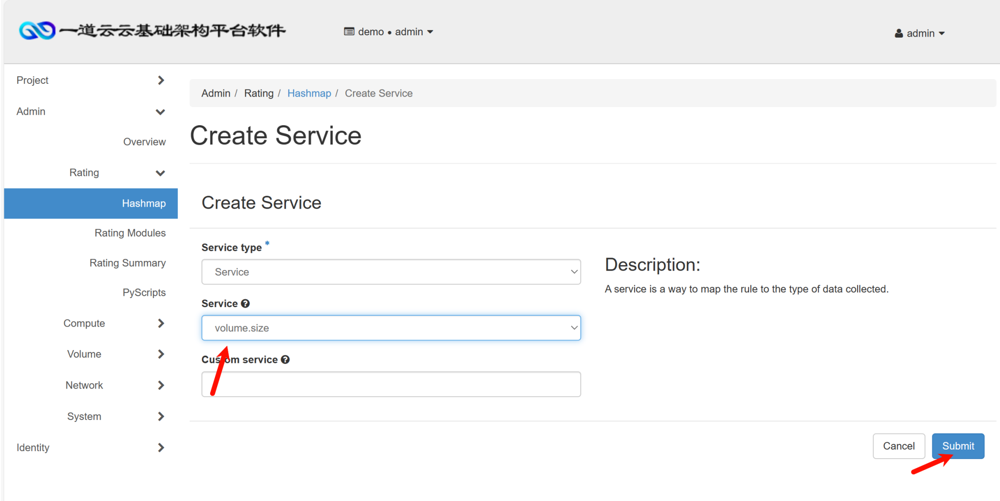

创建 volume_thresholds 组

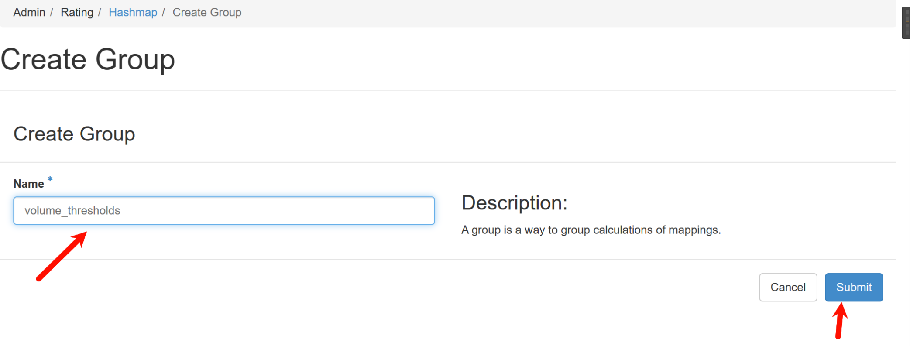

设置每 GB 的价格 为 0.01。

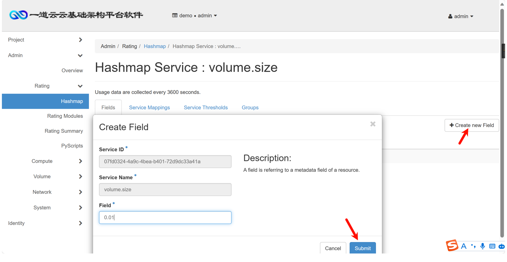

在组 volume_thresholds 中创建阈值，设置若超 过 50GB 的阈值，应用 2%的折扣（0.98）

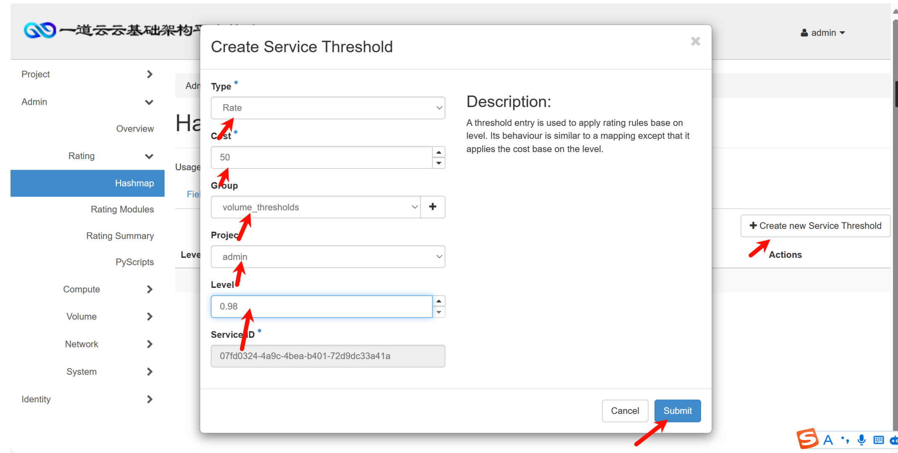

### 19.修改文件句柄数

创建一台云主机，修改相关配置，将控制节点的最大文件句柄数永久修改为 65535

```shell
查看当前句柄数

[root@controller ~]# ulimit -n

[root@controller ~]# vi /etc/security/limits.conf

 #最下面添加 

* soft nofile 65535

* hard nofile 65535
```


### 20.linux系统优化-脏数据回写

Linux 系统内存中会存在脏数据，一般系统默认脏数据 30 秒后会回写磁盘，修改系统 配置文件，要求将回写磁盘的时间临时调整为 60 秒

[root@controller ~]# sysctl -a 查看系统所有调优参数

```shell
[root@controller ~]# sysctl -a | grep vm.dirty
sysctl: reading key "net.ipv6.conf.all.stable_secret"
sysctl: reading key "net.ipv6.conf.default.stable_secret"
sysctl: reading key "net.ipv6.conf.ens33.stable_secret"
sysctl: reading key "net.ipv6.conf.ens36.stable_secret"
sysctl: reading key "net.ipv6.conf.lo.stable_secret"
vm.dirty_background_bytes = 0
vm.dirty_background_ratio = 10
vm.dirty_bytes = 0
vm.dirty_expire_centisecs = 3000
vm.dirty_ratio = 30
vm.dirty_writeback_centisecs = 500
```


```shell
[root@controller ~]# vi /etc/sysctl.conf 

vm.dirty_expire_centisecs=6000

[root@controller ~]# sysctl -p 查看生效
```


### 21.Linux 系统调优-防止 SYN 攻击

修改 controller 节点的相关配置文件，开启 SYN cookie，防止 SYN 洪水攻击

同上一题命令查看可优化项复制粘进去

[root@controller ~]# sysctl -a | grep sync

```shell
[root@controller ~]# sysctl -a | grep sync
fs.quota.syncs = 0
fs.xfs.inherit_sync = 1
fs.xfs.xfssyncd_centisecs = 3000
sysctl: reading key "net.ipv6.conf.all.stable_secret"
sysctl: reading key "net.ipv6.conf.default.stable_secret"
sysctl: reading key "net.ipv6.conf.ens33.stable_secret"
sysctl: reading key "net.ipv6.conf.ens36.stable_secret"
sysctl: reading key "net.ipv6.conf.lo.stable_secret"
net.ipv4.tcp_syncookies = 1
net.ipv6.conf.all.max_desync_factor = 600
net.ipv6.conf.default.max_desync_factor = 600
net.ipv6.conf.ens33.max_desync_factor = 600
net.ipv6.conf.ens36.max_desync_factor = 600
net.ipv6.conf.lo.max_desync_factor = 600
```


```shell
[root@controller ~]# vi /etc/sysctl.conf

net.ipv4.tcp_syncookies = 1
```


## 四.云主机操作

（2）创建网络

在controller节点使用OpenStack相关命令创建一个net网络。

```shell
[root@controller ~]# source /etc/keystone/admin-openrc.sh

[root@controller ~]# openstack network create net

[root@controller ~]# openstack subnet create --network net --subnet-range 10.0.0.0/24 --gateway 10.0.0.1 subnet
```


（3）创建云主机

登录dashboard页面，在左侧菜单栏中选择“项目”-“计算”-“实例”，点击“创建实例”，输入实例名称cirros，默认可用域为nova，数量为1，点击下一步；选择已共享的cirros镜像，选择不创建新卷，点击下一步；选择

m1.tiny实例类型，点击下一步；选择net为虚拟机的网络；这样点击“创建实例”按钮就可以完成虚拟机创建。创建步骤如图4、图5、图6、图7所示。

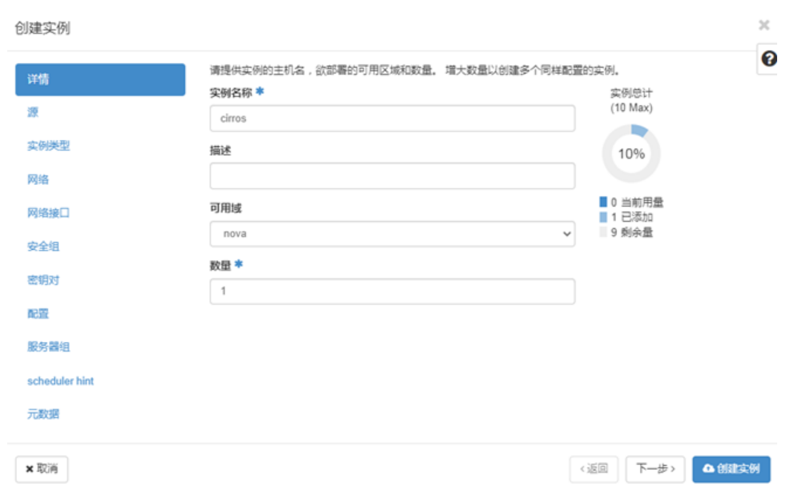

图4 虚拟机创建1


图5 虚拟机创建2

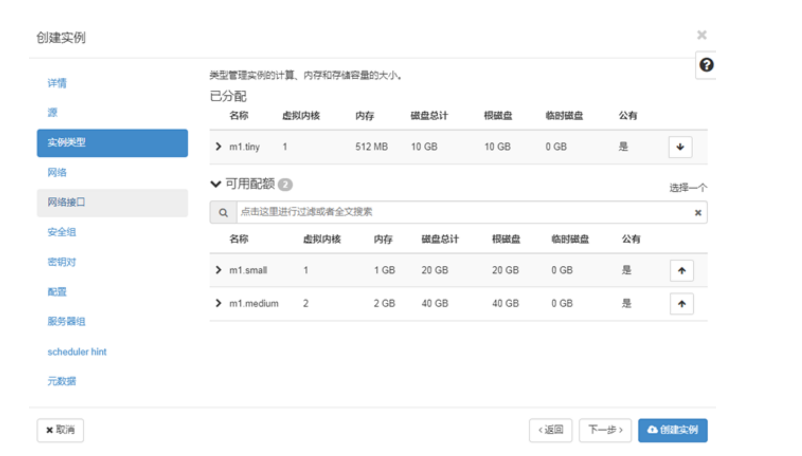

图6 虚拟机创建3

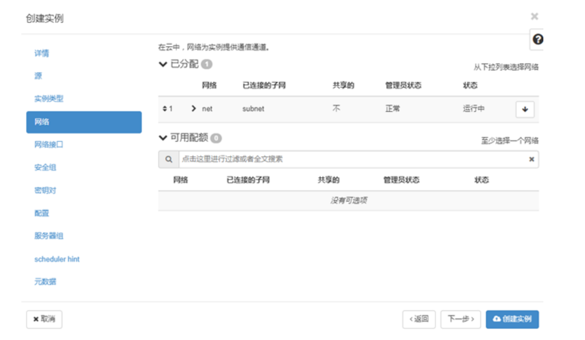

图7 虚拟机创建4


等虚拟机创建完成后，可以看到虚拟机状态为“运行”，如图8所示。只要求创建cirros的云主机不报错，不要求创建后的cirros云主机可以使用CRT连接。


 图8 cirros虚拟机运行

